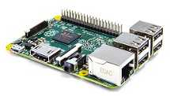
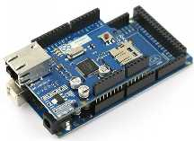

Tutorials
=========

Contents:

.. toctree::
   :maxdepth: 1
   
   tutorials/java_client
   tutorials/raspberrypi_client
   tutorials/arduino_client

On this page you will find several tutorials about how to connect to
Sentilo using various existing platforms and languages.

.. table:: tutorials
   :widths: 40 60
+---------------------------------------------------------------+-----------------------------------+
|                                                               | `Java Client`_                    |
|  .. image:: _static/images/tutorials/java_logo.jpg            | Java 1.6 library that allows      |
|     :width: 202px                                             | access to Sentilo Platform        |
|     :height: 113px                                            | through its REST API Client       |
+---------------------------------------------------------------+-----------------------------------+
|                                                               | `RaspberryPi Client`_             |
|  .. image:: _static/images/tutorials/raspberrypi.jpeg         | Independent platform library      |
|     :width: 215px                                             | created with NodeJS that allows   |
|     :height: 122px                                            | embedded architectures, such as   |
|                                                               | Raspberry Pi, to communicate with |
|                                                               | Sentilo Platform through its REST |
|                                                               | API Client                        |
+---------------------------------------------------------------+-----------------------------------+
|                                                               | `Arduino Client`_                 |
|  .. image:: _static/images/tutorials/arduino-mega-2560-r3.jpg | A simple Arduino library that     |
|     :width: 216px                                             | allows connect with the Official  |
|     :height: 157px                                            | Ethernet Shield to the Sentilo    |
|                                                               | Platform                          |
+---------------------------------------------------------------+-----------------------------------+

.. _Java Client: ./tutorials/java_client.html
.. _RaspberryPi Client: ./tutorials/raspberrypi_client.html
.. _Arduino Client: ./tutorials/arduino_client.html

.. |java_logo.jpg| image:: _static/images/tutorials/java_logo.jpg
   :width: 202px
   :height: 113px
   :target: tutorials/java_client.html

